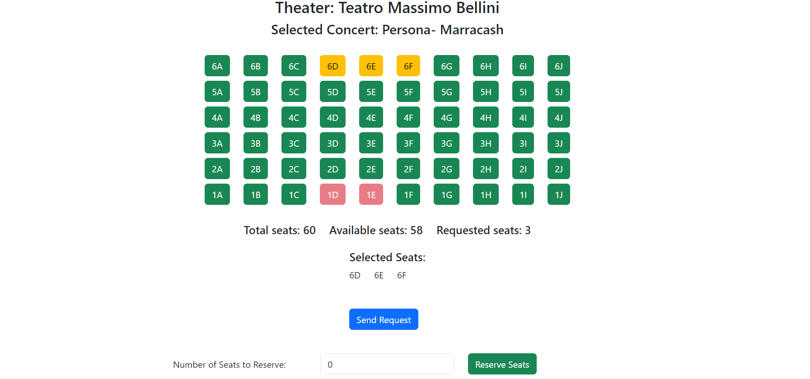

# Exam #3: "Concert Seats"

## Student: s330732 Torrisi Alessandro Rosario

## React Client Application Routes

- Route `/`: Main page that shows the concerts, and if the user is logged in it is also possible to see the reserved seats
- Route `/login` : route used by the user to authenticate
- Route `/concert/:id/seats`: (id of the concert), in this route it is possible to view the seats and if the user is logged in to reserve the seats for that concert

## API Server

- GET `/api/concerts`
  - returns all the concerts from the database
- GET `/api/theaters`
  - returns all the theaters from the database
- GET `/api/concerts/:id/occupied-seats`
  - Given the Id of a concert i can restrive all the occupied seats
- GET `/api/reservation/:id`
  - Given the id of a user i retrive all the reservation for that user for all the concerts
- DELETE `/api/reservation/:id_res`
  - Given the id of a reservation deltetes it from the database
- POST `/api/reservation`
  - this route adds a reservation for a seat given the id of a userm the id of a concert and the id of a theater
  - request body content: concertId,TheatreId,userId, row, col
  - response : returns true if the occupation of the requested seat went well, else gives error
- POST `/api/reserverandomseats`
  - given a number of seat to reserve and the id of a concert, does a reservation for the requested number of seats
  - request body content: number of seat to reserve, concertId
  - response : returns a message of success and the seats reserved
- POST `/api/checkSeats`
  - checks if the seats requested by the user are actually aviable checking in the table of reservation
  - request body content: seats to be reserved
  - response body content: returns the seats and bool value to tell if the seat was already reserved or not

## API Server2

- POST `/api/discount`
  - request : the request contains the JWT token and the list of the reserved seats that will be then used by server 2 to compute the discount value
  - response : contains the discount value computed and the authentication level of the user (if it is loyal or normal)

## Database Tables

- Table `users` - contains id of the user (unique), name, email, hash of the salted pwd, salt, and "loyal" for premium users
- Table `theaters` - contains id of the theater (unique), name of the theater, rows and columns to compute the total seat for that theater (columns has a constrait of beeing smaller then 26 because there are 26 letter in the alphabet and for conversion reason i don't want this value to be greater then 26) and type (small, medium, big)
- Table `concerts` - constains id of the concert (unique), concert name and the theater id of the theater where the concert is held (foreign key)
- Table `occupied_seats` - contains all the reservation from ALL the concerts, it contains : the id of user who booked the seat, of the theater and concert and row and colum occupied
- View `concert_seating_info` - view that contains info about aviable seats (not used)

## Main React Components

- `SeatSelector` (in `in SeatSelector.jsx`): This component is used to display the seats of a concerts, it handles the submition of new reservations and show the user what seats are aviable. Once the submition is complited it also contacts server 2 to compute the discount value for that reservation
- `SeatForm` (in `SeatForm.jsx`): Through this component it is possible to reserve a desidered number of seat, that will be randomly chosen fromm the one that are aviable. If the reservation is successfull it also displays the discount value for that reservation
- `LoginForm` (in `LoginForm.jsx`): This component handles the login of the user
- `ConcertList` (in `ConcertList.jsx`): Used to display the main info of concerts and theaters
- `Reservations` (in `Miscellaneous.jsx`) : Displays the reservation of a logged in with the relevant information (concert and seat reserved) and contains a button that can be used to eliminate the reservation for that seat
- `MyNavbar` (in `Miscellaneous.jsx`) : Navbar that contains the link to let the user login and contains user information.

## Screenshot

## Users Credentials

- s123456@example.com, pwd : loyal user
- yuta.okkotsu@example.com, rika123 : normal user
- satoru.gojo@example.com, onored1 : loyal user
- mario.rossi@example.it, kaizoku : normal user
